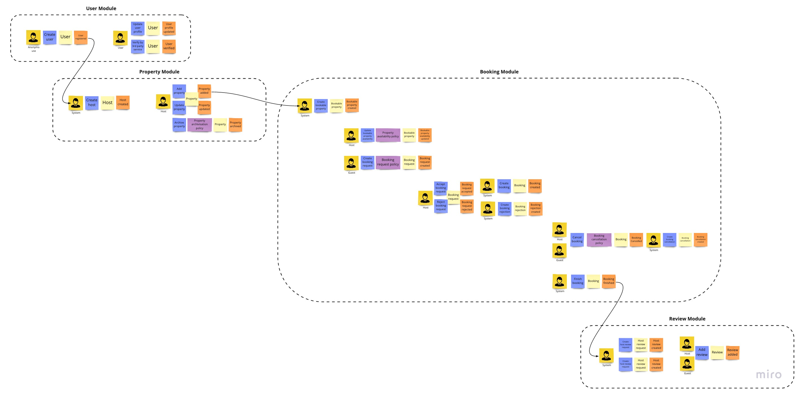
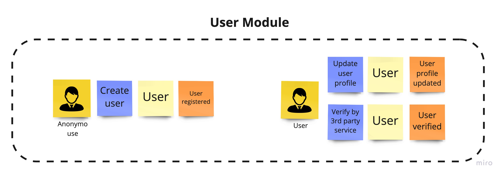
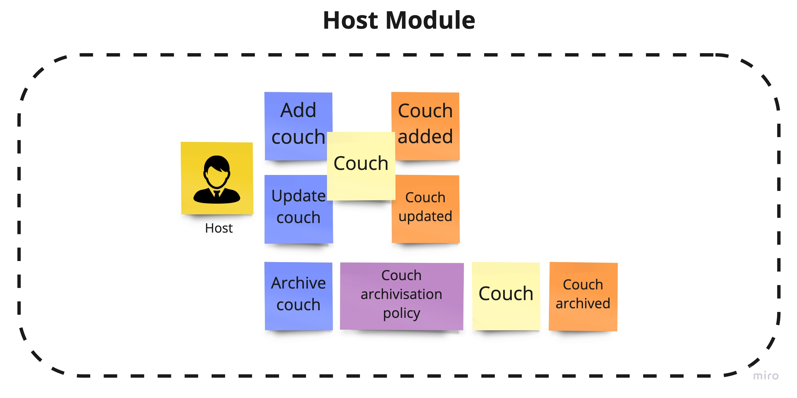
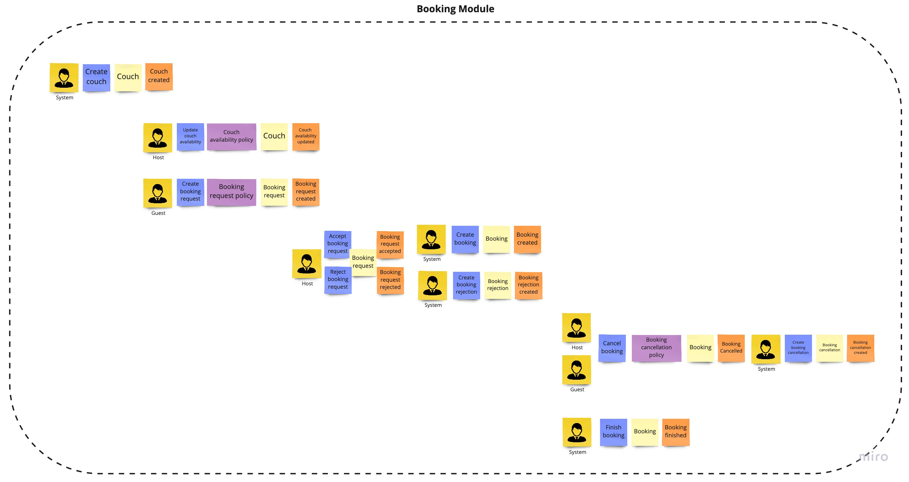
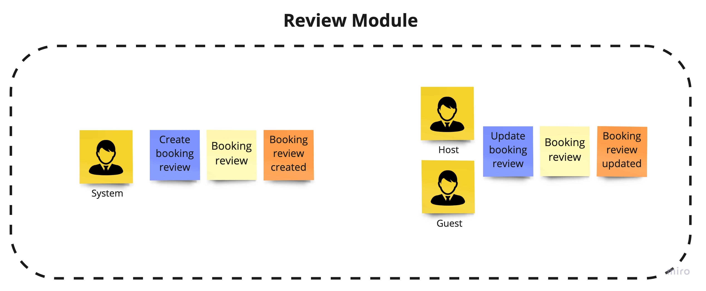

# Travelhoop - Modular monolith in Node.js

The project was created to demonstrate how we can create a modular monolith in Node.js. The main idea of the project was high separation of each module from each other. This allows each module to be developed independently by different teams. As the project develops this will also allow us to easily extract single modules into microservices. For this purpose, I chose a fairly well-known domain and on its example tried to present how the implementation of such an application can look like.
In this file, as well as in the ADR, you will find implementation details as well as decisions that were made during this project. I would like every important point to be documented so that you can easily see the reasoning behind a particular choice.

# Table of contents

- [Travelhoop - Modular monolith in Node.js](#travelhoop---modular-monolith-in-nodejs)
- [Table of contents](#table-of-contents)
- [1. Domain](#1-domain)
  - [1.1 About domain](#11-about-domain)
  - [1.2 Event storming](#12-event-storming)
    - [1.2.1 User module](#121-user-module)
    - [1.2.2 Couch module](#122-couch-module)
    - [1.2.3 Booking module](#123-booking-module)
    - [1.2.4 Review module](#124-review-module)
- [2. Architecture](#2-architecture)
  - [2.1 Overview](#21-overview)
    - [2.1.1 Event driven architecture](#211-event-driven-architecture)
    - [2.1.2 Vertical slices](#212-vertical-slices)
  - [2.2 Modules](#22-modules)
    - [2.2.1 AppModule interface](#221-appmodule-interface)
    - [2.2.2 Module loader](#222-module-loader)
  - [2.3 Communication](#23-communication)
    - [2.3.1 Message broker](#231-message-broker)
  - [2.4 Architectural Decision Records](#24-architectural-decision-records)

# 1. Domain

## 1.1 About domain
Travelhoop - It is an application thanks to which you can offer free accommodation to travelers. It allows you to make new acquaintances, friendships and meet people from all over the world. Each user can search for accommodation in any location in the world. This is a replication of the fairly well-known Couchsurfing app.

## 1.2 Event storming
To discover the domain and what was behind it, I decided to use a very popular method called [event storming](https://www.eventstorming.com/). Below I present a diagram which was created after one session, on the basis of which the application will be built.



### 1.2.1 User module

### 1.2.2 Couch module

### 1.2.3 Booking module

### 1.2.4 Review module


# 2. Architecture

## 2.1 Overview

### 2.1.1 Event driven architecture
To keep the independence of the modules high, I decided to use an event driven approach. It will allow us to synchronize the modules with each other asynchronously. It will also allow for low coupling between them. We will exchange messages (events) between modules. They will carry information about changes that occurred in one of the modules, so that the rest of the modules can react in an appropriate way, updating their state or performing some other operation.

### 2.1.2 Vertical slices
TBU
## 2.2 Modules

### 2.2.1 AppModule interface 
Each module expose implementation of the following interface:

```ts
export interface UseDependencies {
  dbConnection: DbConnection;
  redis: Redis;
}
export interface AppModule {
  basePath: string;
  name: string;
  path: string;
  use: (app: Application, deps: UseDependencies) => void;
  dispatchEvent(event: Event): Promise<void>;
}
```

Here we define:
- **basePath** - for a routing purposes we need to define main route for each module. It will help us orginise the module under specific paths
- **name** - the name of the module. By the implementation of module loader, this should be the name like *some-module*
- **use(app: Application, deps: UseDependencies)** - it's a method which we later use in our `app.ts` file to load whole module. Here we are passing common dependencies like connection to databases, which are shared across all modules. We can also add here our custom error handling, specific for each module, or some other middlewares. What is important, all middlewares defined here, will be a part of the whole pipeline of our express application. So be careful.
- **dispatchEvent(event: Event)** - it's a method, which will be later used by our background message dispatcher, to pass integration events from e.g. queue to our module.

### 2.2.2 Module loader
In `server.ts` which is a main file of our application we are using module loader to load all the modules and register it into container.
Next, registered modules are injected into app.ts, where we define an express execution pipeline. There we are registering all the modules, by executing their `use` method:

```ts
export const createApp = ({ errorHandler, modules, dbConnection, redis }: AppDependencies): Application => {
  (...)

  modules.forEach(m => m.use(app, { dbConnection, redis }));
  
  (...)
```

What is important, to correctly register module in our application we need to define a dependency to this module in `package.json`. Also the name of the module folder must follow this convention *some-module*. E.g. for user module, the folder name must be *user-module*. Under the hood we are loading modules interface by looking up for specific directories in our `/node_modules/@travelhoop` folder.

## 2.3 Communication

### 2.3.1 Message broker

This is the main unit responsible for asynchronous message exchange between modules. It issues the `publish` method responsible for publishing them. Internally, the message broker can implement different types of `MessageDispatcher`.

```ts
interface MessageBrokerDependencies {
  messageDispatcher: MessageDispatcher;
}

export class MessageBroker {
  constructor(private readonly deps: MessageBrokerDependencies) {}

  async publish<TMessage extends object>(message: TMessage) {
    await this.deps.messageDispatcher.publish(JSON.stringify(message));
  }
}
```

Message dispatcher is a simply interface, implemented in various of way. 

```ts
export interface MessageDispatcher {
  publish(message: string): Promise<void>;
}
```

One of the implementaton is `RedisMessageDispatcher`. Under the hood it use a Redis queue to push a message to the consumers.
Since our application is a single deployment unit, `MessageBroker` publishes messages to a single, common queue for all modules. The message is then retrieved by a single consumer. The implementation of the consumer can be found here `/modular-monolith/src/shared/infrastructure/src/messaging/background.message-dispatcher.ts`. It listen for a new message on queue and dispatch it to all the modules, by their interface. 
Responsibility of each module is to decide if the message should be handled or not. Our main application doesn't care about it. Our modules are responsible for themselve.

## 2.4 Architectural Decision Records
All architectural decisions are keeped in `./docs/adr` directory. It captures an important architectural decision made along with its context and consequences. To automate this process I've used [adr-tools](https://github.com/npryce/adr-tools) library. It should help you understand, why I've made some decisions in this project. Very often we have a couple of possibility how to solve some problems. Often it has some pros and cons. It is important to make this decisions, knowing potential consequences. 
