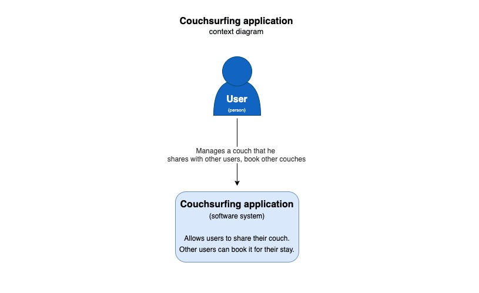
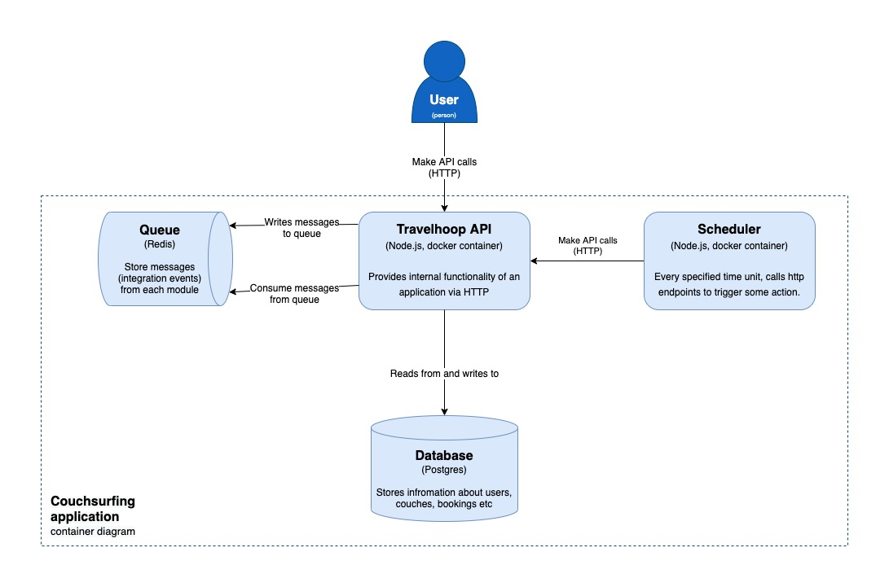
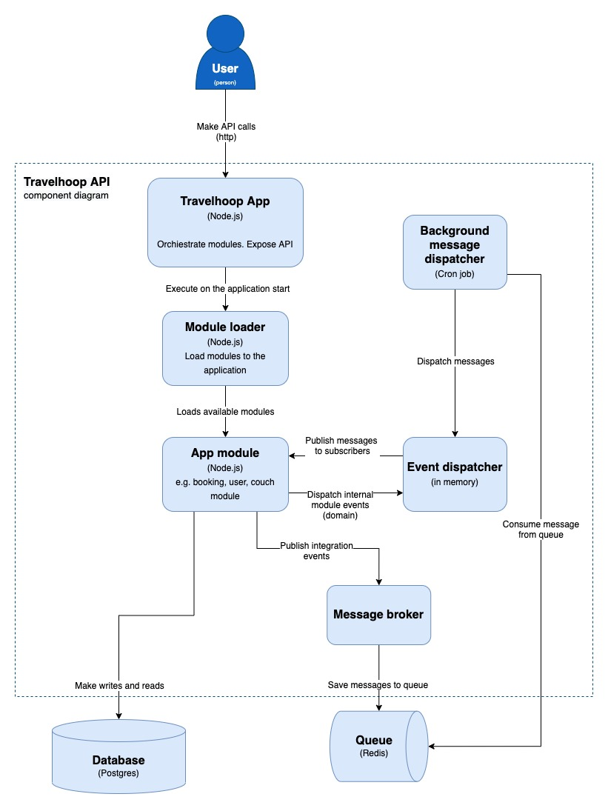

# Travelhoop - Modular monolith in Node.js

The project was created to demonstrate how we can create a modular monolith in Node.js. The main idea of the project was high separation of each module from each other. This allows each module to be developed independently by different teams. As the project develops this will also allow us to easily extract single modules into microservices. For this purpose, I chose a fairly well-known domain and on its example tried to present how the implementation of such an application can look like.
In this file, as well as in the ADR, you will find implementation details as well as decisions that were made during this project. I would like every important point to be documented so that you can easily see the reasoning behind a particular choice.

## How to run a project?

### Local development

Project under the hood, to manage monorepo use [Rush](https://rushjs.io/). For this reason, this library must be installed globally. This can be done through the following command:
```
npm install rush -g
```
Then you need to install node modules in all packages by
```
rush update
```
When the installation is finished, we need to build the whole project
```
rush build
```
The project needs environment variables to work properly. We can find them here `src/app/travelhoop/.env.dist`. In the simplest way we can use the following command to copy it. 
```
cp src/app/travelhoop/.env.dist src/app/travelhoop/.env
```
For the application to work properly, we need to fire up an instance of postgres and redis. We can do this through the `docker-compose.yaml` file which contains their definitions.
```
docker-compose up
```
To locally run the project, we need to use two additional commands. The first one is used to fire the swe transpiler to keep the project monitored and rebuilt. The second one allows us to fire the server locally. What is important, the second command must be run from `src/app/travelhoop` directory. It is a good idea to run these two commands in separate terminal windows.
```
rush build:watch

npm run start-dev
```

# Table of contents

- [Travelhoop - Modular monolith in Node.js](#travelhoop---modular-monolith-in-nodejs)
  - [How to run a project?](#how-to-run-a-project)
    - [Local development](#local-development)
- [Table of contents](#table-of-contents)
- [1. Domain](#1-domain)
  - [1.1 About domain](#11-about-domain)
  - [1.2 Event storming](#12-event-storming)
    - [User module](#user-module)
    - [Couch module](#couch-module)
    - [Booking module](#booking-module)
    - [Review module](#review-module)
- [2. Architecture](#2-architecture)
  - [2.1 C4 Diagram](#21-c4-diagram)
    - [C1 - System context](#c1---system-context)
    - [C2 - Containers](#c2---containers)
    - [C3 - Components](#c3---components)
  - [2.2 Overview](#22-overview)
    - [Event driven architecture](#event-driven-architecture)
    - [Module architecture](#module-architecture)
    - [Vertical slices](#vertical-slices)
  - [2.3 Modules](#23-modules)
    - [AppModule interface](#appmodule-interface)
    - [Module loader](#module-loader)
  - [2.4 Communication](#24-communication)
    - [Events](#events)
    - [Message broker](#message-broker)
    - [Event dispatcher](#event-dispatcher)
  - [2.5 Architectural Decision Records](#25-architectural-decision-records)
  - [2.6 Scheduler](#26-scheduler)
- [3. Tests](#3-tests)
  - [3.1 Unit tests](#31-unit-tests)

# 1. Domain

## 1.1 About domain
Travelhoop - It is an application thanks to which you can offer free accommodation to travelers. It allows you to make new acquaintances, friendships and meet people from all over the world. Each user can search for accommodation in any location in the world. This is a replication of the fairly well-known Couchsurfing app.

## 1.2 Event storming
To discover the domain and what was behind it, I decided to use a very popular method called [event storming](https://www.eventstorming.com/). Below I present a diagram which was created after one session, on the basis of which the application will be built.


### User module

### Couch module

### Booking module

### Review module


# 2. Architecture

## 2.1 C4 Diagram

The [C4 model](https://c4model.com/) was created by Simon Brown, who started teaching people about software architecture, while working as a software developer/architect in London. Part of Simon's training course was a design exercise, where groups of people were given some requirements, asked to do some design, and to draw some diagrams to express that design.

Although this was a design focussed exercise, the wide variety of diagrams made it evident that the visualisation of ideas was a skill that most people sorely lacked. The C4 model is essentially a formalisation of how Simon used to visualise software architecture, which has evolved over the years.
### C1 - System context

### C2 - Containers

### C3 - Components

## 2.2 Overview

### Event driven architecture
To keep the independence of the modules high, I decided to use an event driven approach. It will allow us to synchronize the modules with each other asynchronously. It will also allow for low coupling between them. We will exchange messages (events) between modules. They will carry information about changes that occurred in one of the modules, so that the rest of the modules can react in an appropriate way, updating their state or performing some other operation.

### Module architecture
Each module has a different level of complexity. Therefore, I decided to have two different architectures depending on the complexity.

**CRUD Architecture** - the simplest architecture, we use it only for very simple and shallow modules, without a lot of business logic. 

1. **Api** - Contains a definition of routing, DI container and implementation of App Module interface.
2. **Core** - Contains a following directories:
     - dto - objects which transport data from routing to the application services
     - entities - definition of a database entities
     - error - errors used in scope of the module
     - events - integration events that are then handled by other modules
     - repositories - data access layer to database
     - services - application services, it contains the CRUD logic of the module
     - subscribers - listeners of a events fired from other modules

**Clean Architecture** - more complex architecture. We can use it for a modules with rich bussiness logic. We use it an DDD approach to module entities, and relation between components in this module.

In our case, going from the top, each folder in the module implementing the pure architecture has this layout.The hierarchy is worth noting. Each folder can import things from the bottom. Instead, it knows nothing about what's going on above. We can say that api knows about everything that happens in our application, but the domain should remain without references to the application or infrastructure layer.
  - api - objects which transport data from routing to the application services
  - infrastructure - definitions of mapping our entities to data access layer. In our case, we use mikro-orm to define how the entities should be handled on database side
  - application - contains handlers, responsible for handling our use cases. Here we are communicate with external services.
  - domain - definitions of our core domain. Here we are putting the aggregates root, entities, policies, domain services and everything related to DDD domain layer.


[source](https://www.freecodecamp.org/news/a-quick-introduction-to-clean-architecture-990c014448d2/)
### Vertical slices
TBU

## 2.3 Modules

### AppModule interface 
Each module expose implementation of the following interface:

```ts
export interface UseDependencies {
  dbConnection: DbConnection;
  redis: Redis;
}
export interface AppModule {
  basePath: string;
  name: string;
  path: string;
  use: (app: Application, deps: UseDependencies) => void;
  dispatchEvent(event: Event): Promise<void>;
}
```

Here we define:
- **basePath** - for a routing purposes we need to define main route for each module. It will help us orginise the module under specific paths
- **name** - the name of the module. By the implementation of module loader, this should be the name like *some-module*
- **use(app: Application, deps: UseDependencies)** - it's a method which we later use in our `app.ts` file to load whole module. Here we are passing common dependencies like connection to databases, which are shared across all modules. We can also add here our custom error handling, specific for each module, or some other middlewares. What is important, all middlewares defined here, will be a part of the whole pipeline of our express application. So be careful.
- **dispatchEvent(event: Event)** - it's a method, which will be later used by our background message dispatcher, to pass integration events from e.g. queue to our module.

### Module loader
In `server.ts` which is a main file of our application we are using module loader to load all the modules and register it into container.
Next, registered modules are injected into app.ts, where we define an express execution pipeline. There we are registering all the modules, by executing their `use` method:

```ts
export const createApp = ({ errorHandler, modules, dbConnection, redis }: AppDependencies): Application => {
  (...)

  modules.forEach(m => m.use(app, { dbConnection, redis }));
  
  (...)
```

What is important, to correctly register module in our application we need to define a dependency to this module in `package.json`. Also the name of the module folder must follow this convention *some-module*. E.g. for user module, the folder name must be *user-module*. Under the hood we are loading modules interface by looking up for specific directories in our `/node_modules/@travelhoop` folder.

## 2.4 Communication

### Events

The main unit of information transfer between and within modules are events. Depending on the purpose we can distinguish two types:

**Domain events** - produced by action taken on aggregate. It is handled by in-memory mediator within a signle transaction. It is handled synchronously. It is a preffered way to handle side effect accross multiple aggregates within the same domain. So we will limit usage of domain events to the module. Domain events are handled by DomainEventDispatcher.

**Integration events** - Messages exchanged between different modules of our application. They are also used to communicate with external services. They are handled asynchronously. Using a dedicated service, we can translate domain events into integration events, which will then be handled by the message broker.

In our environment, both of these events have implementations of two different interfaces that look the same. We treat these interfaces, as a marker, telling us the purpose of the event. From the programming side, we could mark all events with one interface, because we have no way to distinguish which class implements which interface. However, we do this so that people who will be familiar with our code, have a clear understanding of how the event will be handled. 

### Message broker

This is the main unit responsible for asynchronous message exchange between modules. It issues the `publish` method responsible for publishing them. Internally, the message broker can implement different types of `MessageDispatcher`.

```ts
interface MessageBrokerDependencies {
  messageDispatcher: MessageDispatcher;
}

export class MessageBroker {
  constructor(private readonly deps: MessageBrokerDependencies) {}

  async publish<TMessage extends object>(message: TMessage) {
    await this.deps.messageDispatcher.publish(JSON.stringify(message));
  }
}
```

Message dispatcher is a simply interface, implemented in various of way. 

```ts
export interface MessageDispatcher {
  publish(message: string): Promise<void>;
}
```

One of the implementaton is `RedisMessageDispatcher`. Under the hood it use a Redis queue to push a message to the consumers.
Since our application is a single deployment unit, `MessageBroker` publishes messages to a single, common queue for all modules. The message is then retrieved by a single consumer. The implementation of the consumer can be found here `/modular-monolith/src/shared/infrastructure/src/messaging/background.message-dispatcher.ts`. It listen for a new message on queue and dispatch it to all the modules, by their interface. 
Responsibility of each module is to decide if the message should be handled or not. Our main application doesn't care about it. Our modules are responsible for themselve.

### Event dispatcher


## 2.5 Architectural Decision Records
All architectural decisions are keeped in `./docs/adr` directory. It captures an important architectural decision made along with its context and consequences. To automate this process I've used [adr-tools](https://github.com/npryce/adr-tools) library. It should help you understand, why I've made some decisions in this project. Very often we have a couple of possibility how to solve some problems. Often it has some pros and cons. It is important to make this decisions, knowing potential consequences. 

## 2.6 Scheduler
The Scheduler is a separate application, for this reason it is placed in the `src/app` folder where things that are deployed separately will eventually be located.
Using HTTP shots, it shoots our application every specified time, triggering some action.

In order to add a new Job, we need to do the following:

1. add a new definition in `/src/app/scheduler/src/jobs`. In the simplest case, we can copy an already existing job and change only `URL_PATH`. e.g.
```ts
import { httpClient } from "../http.client";

const URL_PATH = "booking/finish-bookings";

(async () => {
  await httpClient(URL_PATH);
})();

```
2. update the `/src/app/scheduler/crontab file with the new job definition. First, we define how often our job should be fired. Then we define the command that is to be executed. And at the end we indicate the file where we put our logs.

```
* * * * * node /app/src/app/scheduler/build/jobs/finish-bookings.job.js >> /var/log/cron.log 2>&1

```

For security reasons, each endpoint that is used by our scheduler, should be secured using the `x-scheduler-token` header. For this reason, we have created a middleware on our application side, which easily validates its correctness and throws an exception when the header does not match. On the scheduler side, the token is added at the `httpClient` level, so when defining a job, we don't have to remember to define it each time.
Of course, the approach of shooting from an external application to ours via http has its pros and cons. The biggest advantage is that when scaling the application, shooting it through the load balancer, we are sure that the request will be served only once, by a single instance. So even having a process that will strongly eat up our resources, the rest of the instance will be able to take over the traffic. The second issue is the ease of replacement of this layer and move to the implementation of jobs provided by e.g. AWS.
# 3. Tests
For testing purposes I am using following stack:
[Mocha](https://github.com/mochajs/mocha) - as a test runner
[Chai](https://github.com/chaijs/chai) - asseration library
[Ts-Mockito](https://github.com/NagRock/ts-mockito) - mocking library

Because tests are run on `.js` files, you need to run watcher at first, or build the project. You can do it by run `rush build:watch` or `rush build`
## 3.1 Unit tests

Unit test should focus mostly on domain logic. For this reason, most of this type of testing will be in modules that implement the clean architecture. The tests are located at the root level of the domain directory.
An important issue in unit testing is to test only publicly available methods. We should not change the implementation of a class just for the sake of testing. If a method is marked as private, we should not make it public just for testing purposes. Let the public interface be responsible for using those private methods that it needs. Through it we should test them.

In assert step we will be looking at mainly two things:
1. whether valid events have been published, after the action, and whether they contain the correct information
2. whether any rules were broken/whether the class threw an exception
  
Example test:
```typescript
it("accept booking request", () => {
  // arrange
  const bookingRequest = createCouchBookingRequest();

  // act
  bookingRequest.accept();

  // assert
  const { events } = bookingRequest;

  expect(events).length(1);
  expect(events[0]).instanceOf(CouchBookingStatusChanged);

  const { payload } = events[0] as CouchBookingStatusChanged;

  expect(payload.status).to.be.equal(RequestStatus.Accepted);
  expect(payload.couchBookingRequestId).to.be.equal(bookingRequest.id);
  expect(payload.rejectionReason).to.be.undefined!;
});
```