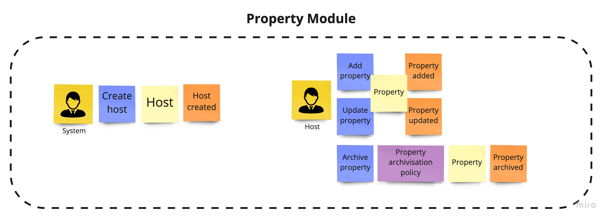

# Travelhoop - Modular monolith in Node.js

The project was created to demonstrate how we can create a modular monolith in Node.js. The main idea of the project was high separation of each module from each other. This allows each module to be developed independently by different teams. As the project develops this will also allow us to easily extract single modules into microservices. For this purpose, I chose a fairly well-known domain and on its example tried to present how the implementation of such an application can look like.
In this file, as well as in the ADR, you will find implementation details as well as decisions that were made during this project. I would like every important point to be documented so that you can easily see the reasoning behind a particular choice.

# 1. Domain

## About domain
Travelhoop - It is an application thanks to which you can offer free accommodation to travelers. It allows you to make new acquaintances, friendships and meet people from all over the world. Each user can search for accommodation in any location in the world. This is a replication of the fairly well-known Couchsurfing app.

## Event storming
To discover the domain and what was behind it, I decided to use a very popular method called [event storming](https://www.eventstorming.com/). Below I present a diagram which was created after one session, on the basis of which the application will be built.

### User module

### Property module

### Booking module

### Review module

# 2. Architecture

## Architectural Decision Records
All architectural decisions are keeped in `./docs/adr` directory. It captures an important architectural decision made along with its context and consequences. To automate this process I've used [adr-tools](https://github.com/npryce/adr-tools) library. It should help you understand, why I've made some decisions in this project. Very often we have a couple of possibility how to solve some problems. Often it has some pros and cons. It is important to make this decisions, knowing potential consequences. 
